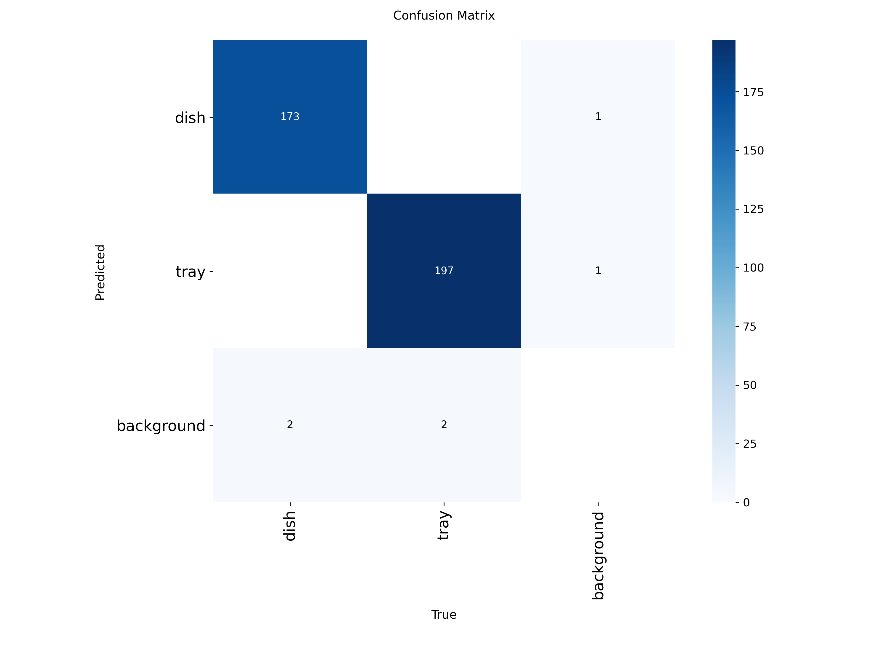

# `Path A`

## Setup + download model

```pip
pip install -r requirements.txt
```

```model
yolov11n.pt
```

## Run app.py

```powershell
python app.py
```

## run docker file

setup Dockerfile

```Dockerfile
FROM ultralytics/ultralytics:latest

WORKDIR /app

COPY app.py /app/

RUN pip install flask opencv-python

EXPOSE 5000

CMD ["python", "app.py"]
```

powershell

```powershell
docker build -t yolov11-webcam .
```

## view

path URL

```path
http://127.0.0.1:5000/video | http://localhost:5000/video
```

# `Path B`

## Train at train_model.ipynb

Model result:

```models
best.pt / last.pt
```


